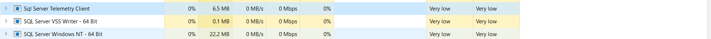

# Dabatabase 2 Innitial Briefing

## About the folders in this github branch

There will be 2 main separate folders once you clone this branchn that need your attention, a Database folder and a STIX folder. The STIX folder is bascially a folder where it contains a separate STIX small project running on a local Northwind database, whereas in the Database folder you can find all of the necessary assignments that are still under development as well as database 2 lectures that can also be found on Blackboard     

## SQL Server Express & SSMS (SQL Server Management Studio)
SQL Server Express is, as the name implies, a database management system in which you can store and access the information stored in many different databases on your server. It is a free version from Microsoft primarily focuses on RDBMS (Relational Database Management System). Where as SSMS is just a graphical user interface (an enviroment) where you can select, browse, manage and access the databases from a server you got from installing SQL Server. Think of the Server Express as the back-end, and the SSMS as the front-end tool

### Installing SQL Server from Microsoft
1. Go to the official Microsoft page for downloading the SQL Server  [Get from here](https://www.microsoft.com/en-us/sql-server/sql-server-downloads?rtc=1)

2. Scroll down a bit, search for the Express edition and click download now

3. Download the .exe file, and double click to run it 

4. Select Basic installation type, agree on the terms and condition, and choose the location where do you want to download it (recommendation: just leave it to default location) 

5. Then wait for it to install on your machine (it's gonna take a while), after it's done installing, don't close the process just yet as it is showing you a couple of important information, one thing you should take note of is the connection string in the first line of information

6. After SQL Server is installed on your machine, you basically will have a running relational database engine that you can connect into

**It is important to take note that the sql statements in SQL Server is slightly a bit different, than say MySQL sql statements. Some of the statements exist in MySQL but will not work on SQL Server statements, and vice verca. You can do research about it and find the difference by yourself on the internet**

### Installing SSMS

7. If you still have the window from the SQL Server installation running, you can see below in the third button that says 'Install SSMS', you can click on that to get SSMS or alternatively you can get it from the official Microsoft download page [From here](https://docs.microsoft.com/en-us/sql/ssms/download-sql-server-management-studio-ssms?view=sql-server-ver16), scroll down until you see 'Download SSMS', get the version 18 because version 19 is still under development and is only just a preview

6. After you download and install the exe file, you just have to specify the location where you want to install (again, it is recommended that you just leave everything on default, nothing about the installation that are important enough to take note of)

7. After it is being installed, you can find the application by just typing SSMS on your Windows search bar, and it will automatically find it for you

8. When you first run it, on the initial window select Database Engine as your server type, then you need to specify which kind of server connection you want to make, just click on the dropdown button next to Server name, select browse for more. On the Local Servers tab, click on Database Engine

9. If you have already have a SQL Server installed on your computer, it will automatically display it with this format *Your computer name/SQLExpress* (Note: if you installed 2 SQL Servers in your computer, then it will show 2 different SQL Servers). Click on it and press okay

10. On the Authentication, select Windows authentication since the other authentications require you to enter a login name and/or password

11. In Object Explorer, on the left-side panel you can find all of objects that are stored in your particular server. You can create a database by right-click on Databases folder and select Create Database, or you can create a new query and run a sql statement from there. I recommend you play along with it for quite a while to get more familiar using it.

**You can also watch this video (https://www.youtube.com/watch?v=LIytfaWH_10), if you prefer to watch a practical approach rather than reading the guide** 

     

     
